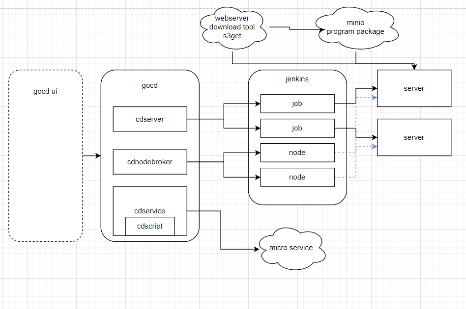

# github.com/liumingmin/gocd
golang continue deploy

<!-- toc -->

tips:

1. binary from aws s3(or minio)

2. jenkins concurrent run job may get same taskId(queueId), 
   so create same as num executor jobs to run
   
