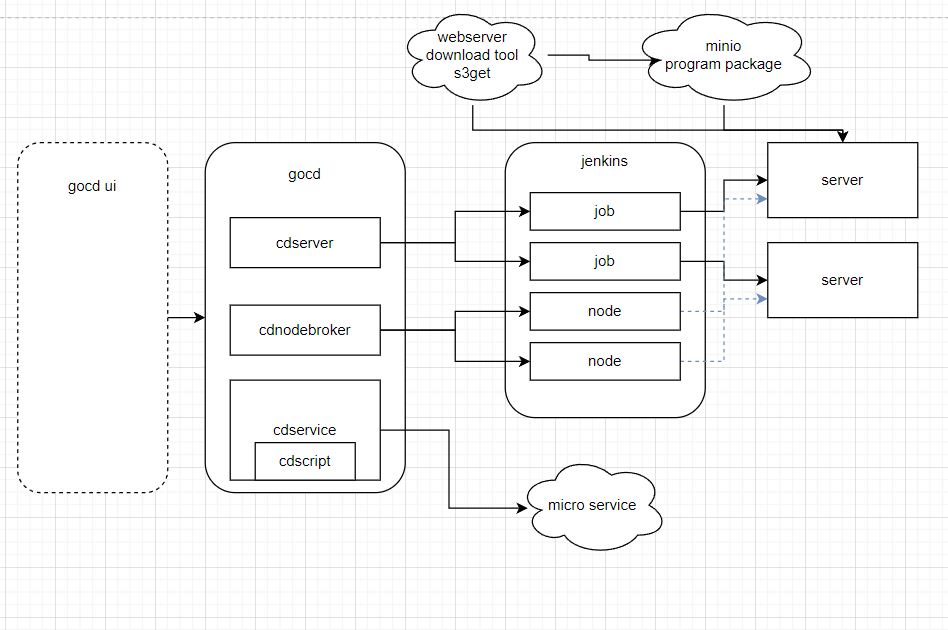

# github.com/liumingmin/gocd
golang continue deploy



<!-- toc -->

- [cd_server_test.go usage](#cd_server_testgo-usage)
- [cmd](#cmd)
- [doc](#doc)

<!-- tocstop -->

tips:

1. binary from aws s3(or minio)

2. jenkins concurrent run job may get same taskId(queueId), 
   so create same as num executor jobs to run
   
## cd_server_test.go usage
### TestGetNodes
```go

	nodes, err := getTestCdServer().GetNodeBroker().getAllNodes(context.Background())
	if err != nil {
		t.Fatal(err)
	}

	for _, node := range nodes {
		t.Log(node)
	}
```
### TestCreateNode
```go

	err := getTestCdServer().GetNodeBroker().CreateNode(context.Background(), "172.17.0.4", "172.17.0.4",
		CdNodeCredIdOption("defssh"), CdNodeNumExecutorsOption(5))
	t.Log(err)
```
### TestDeleteNode
```go

	ok, err := getTestCdServer().GetNodeBroker().DeleteNode(context.Background(), "172.17.0.4")
	t.Log(ok, err)
```
### TestDeploy
```go

	jserver := getTestCdServer()
	svc := getTestCdService()
	for i := 0; i < 4; i++ {
		jobName, taskId, _ := jserver.DeploySimple(context.Background(), svc, "172.17.0.4") //172.17.0.3

		fmt.Println(jobName, taskId)

		//time.Sleep(time.Second)
	}
```
### TestGetTaskBuild
```go

	build, _ := getTestCdServer().GetDeployResult(context.Background(), "1-prod-runit-172.17.0.4-1", 138)
	bs, _ := json.Marshal(build)
	t.Log(string(bs))
```
### TestS3Get
```go

	sess, _ := session.NewSession(&aws.Config{
		Credentials: credentials.NewStaticCredentials("Vg6p9p/WM55ZbiZkE8Vyzw==",
			"r0yRc7Yxc0fB7yWRoaWJrvLlC3hShtqBFfqj13PKTLo=", ""),
		Region:           aws.String("zh-south-1"),
		Endpoint:         aws.String("http://localhost:9005"),
		DisableSSL:       aws.Bool(true),
		S3ForcePathStyle: aws.Bool(true),
	},
	)

	downloader := s3manager.NewDownloader(sess)
	file, err := os.Create("./pkg.tgz")
	if err != nil {
		t.Log(err)
		return
	}
	_, err = downloader.Download(file,
		&s3.GetObjectInput{
			Bucket: aws.String("test"),
			Key:    aws.String("pkg.tgz"),
		})
	if err != nil {
		t.Log(err)
		return
	}

	//ioutil.WriteFile("./pkg.tgz", buffer.Bytes(), 0666)
```
### TestNewDefaultCdScript
```go

	cdScript := NewDefaultCdScript()
	scriptConfig, _ := cdScript.GetCdTaskScriptConfig("127.0.0.1")
	t.Log(scriptConfig)
```
## cmd
### s3get
## doc
